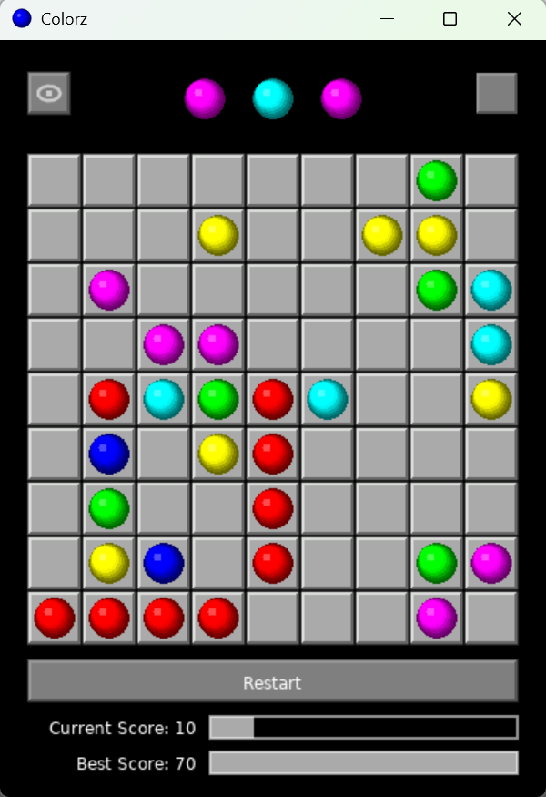

# Colorz: Color Lines Game

A modern implementation of the classic Color Lines game built with LÖVE2D (Lua).

**Most of the code in this repository was written by Large Language Models (LLMs). (Including this README.)**

## Game Description

Colorz is a puzzle game where you move colored balls across a 9×9 grid to form lines of 5 or more matching colors. When a line is formed, the balls disappear, and you score points. The challenge comes from new balls that appear after each move unless you form a chain.



## Features

- **Core Gameplay:**
  - Move balls if a valid path exists
  - Form chains of 5+ same-colored balls to remove them and score points
  - New balls appear after each move if no chain is formed
  - Game over when the board fills up
  
- **Enhanced Game Mechanics:**
  - Preview zone showing upcoming balls
  - Combo system for consecutive chains
  - Current and Best score tracking
  - Undo functionality for the last move

- **Visual Effects:**
  - Smooth ball animations (movement, fading in/out)
  - Selected ball bounce animation
  - Visual board design with bevel effects

- **UI Features:**
  - Toggle preview visibility
  - Restart game with confirmation dialog
  - Progress bars for score visualization

- **Technical Features:**
  - Game state persistence across sessions
  - Cross-platform support (Desktop & Android)
  - Efficient path-finding using Breadth-First Search
  - Responsive design that adapts to different screen sizes

## How to Play

1. Click a ball to select it
2. Click an empty cell to move the selected ball there (if a path exists)
3. Form chains of 5+ same-colored balls (horizontally, vertically, or diagonally)
4. Try to keep the board from filling up as long as possible

## Controls

- **Mouse/Touch:** Select and move balls, interact with buttons
- **Eye Button:** Toggle the preview of upcoming balls
- **Undo Button:** Revert to the state before your last move
- **Restart Button:** Start a new game (with confirmation)

## Build & Run

This game requires LÖVE2D to run. Download it from [love2d.org](https://love2d.org/).

### Desktop

```
love /path/to/colorz
```

### Android

Follow the LÖVE2D Android packaging instructions.

## License

This project is released into the **Public Domain**. You may use, modify, distribute, and perform the work, even for commercial purposes, all without asking permission.

## Attribution

While not required, if you use or build upon this work, a reference to this repository would be appreciated. 
